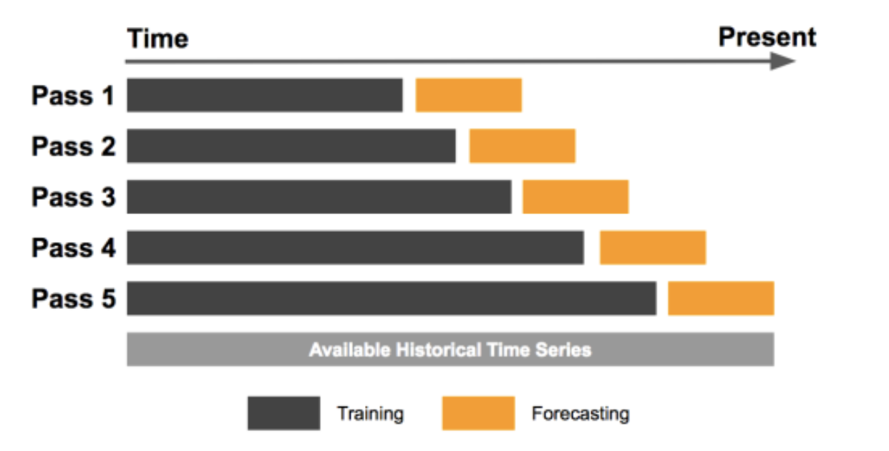
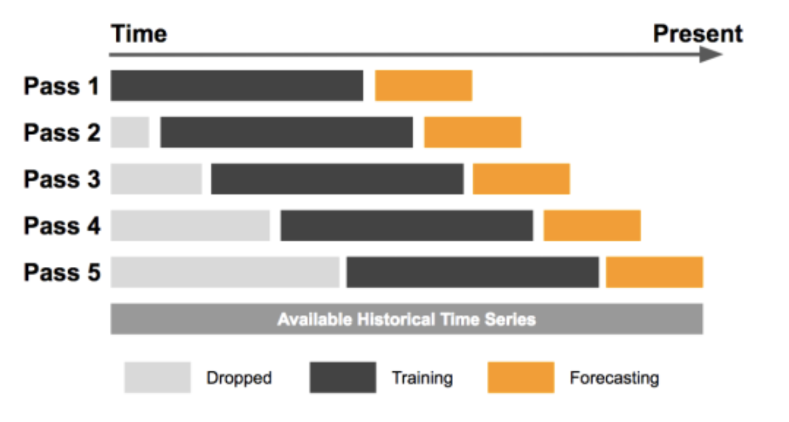

## Prezentacja 1

-   Wprowadzenie pojęcia portfela inwestycyjnego
-   Podstawowe pojęcia dotyczące portfela:
    -   Dywersyfikacja
    -   Wagi aktywów
    -   Stopy zwrotu (średnia i skumulowana)
    -   Ryzyko portfela (wariancja)

## Prezentacja 3

## Pyfolio

::::: columns
::: {.column width="50%"}
{fig-align="center" width="75%"}

-   Raportowanie wyników strategii inwestycyjnych w Pythonie
:::

::: {.column width="50%"}
{fig-align="center" width="75%"}
:::
:::::

## Teoria portfelowa {.smaller}

::::: columns
::: {.column width="50%"}
-   Efektywna granica\
-   Biblioteka PyPortfolioOpt\
-   Optymalizacja portfela:\
    <!-- chodzi o to, że możemy zadać stopę zwrotu i minimalizować ryzyko lub szukać porftela o minimalnym ryzyku i maksymalnej stopie zwrotu (przy tym zadanym ryzyku) -->
    -   Zadana stopa zwrotu\
    -   Minimalne ryzyko\
    -   Maksymalny wskaźnik Sharpe'a\
-   Alternatywne sposoby obliczania średniej i wariancji:
    -   Zwroty i ryzyko ważone wykładniczo\
    -   Semikowariancja\
:::

::: {.column width="50%"}
{fig-align="center" width="100%" style="margin-top: 2em;"}
:::
:::::

## Prezentacja 5

## Model GARCH w bibliotece arch {.smaller}

-   Założenia dotyczące rozkładu standaryzowanych reszt:
    -   Rozkład normalny
    -   Rozkład t-Studenta
    -   Skośny rozkład t-Studenta
-   Założenia o średniej:
    -   Stała średnia
    -   Zerowa średnia
    -   Średnia modelowana jako proces AR
-   Asymetryczne wahania zmienności:
    -   Model GJR-GARCH
    -   Model EGARCH

## Prognozy oparte na oknie ruchomym

::::: {columns}
::: {.column width="50%"}
-   Expanding window forecast\
    {width="100%"}
:::

::: {.column width="50%"}
-   Fixed window forecast\
      {width="100%"}
:::
:::::

## Ocena wydajności modelu {.smaller}

-   Testowanie istotności parametrów
-   Walidacja założeń modelu:
    -   Wykres residuów
    -   Autokorelacja residuów - wykres ACF
    -   Test Ljung-Boxa
-   Miary dopasowania modelu:
    -   Akaike Information Criterion (AIC)
    -   Bayesian Information Criterion (BIC)
-   Backtesting modelu GARCH(1,1):
    -   Mean Absolute Error (MAE)
    -   Root Mean Squared Error (RMSE)
-   Implementacja modelu GARCH z procesem ARMA dla średniej

## Źródła

-   <https://inyova.ch/en/expertise/efficient-frontier-investment-theory/>

-   <https://goldinlocks.github.io/ARCH_GARCH-Volatility-Forecasting/>
